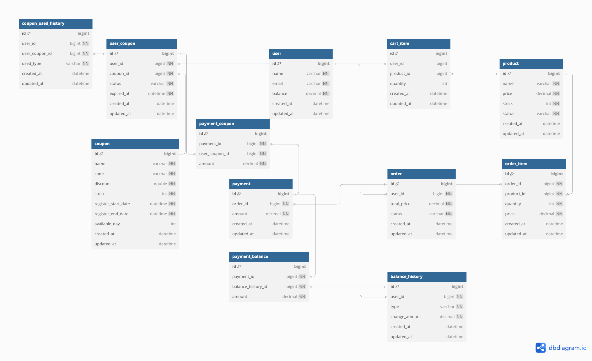

# ERD

> [참고사항]
> - 주문/결제 API 요구사항 중  "사용자 식별자와 (상품 ID, 수량) **목록**을 입력받아 주문하고 결제를 수행하는 API 를 작성"해야 하므로 Cart 및 CartItem 을 임의로 추가함.

## 1. 테이블 간의 관계

### User와 BalanceHistory (1:N 관계)
- 한 사용자는 여러 잔액 변동 이력을 가질 수 있습니다.
- `user_id`를 통해 `BalanceHistory`에서 특정 사용자의 잔액 변동 내역을 추적할 수 있습니다.

### User와 Order (1:N 관계)
- 한 사용자는 여러 주문을 생성할 수 있습니다.
- `user_id`를 통해 `Order` 테이블에서 사용자의 주문 내역을 확인할 수 있습니다.

### Order와 OrderItem (1:N 관계)
- 한 주문에 여러 상품(`OrderItem`)이 포함될 수 있습니다.
- `order_id`를 통해 특정 주문에 포함된 상품 항목을 추적할 수 있습니다.

### Order와 Payment (1:1 관계)
- 한 주문은 하나의 결제 정보와 연결됩니다.
- `order_id`를 통해 해당 주문의 결제 상태와 금액을 확인할 수 있습니다.

### User와 UserCoupon (1:N 관계)
- 한 사용자는 여러 쿠폰(`UserCoupon`)을 보유할 수 있습니다.
- `user_id`를 통해 특정 사용자가 보유한 쿠폰 정보를 관리합니다.

### Coupon과 UserCoupon (1:N 관계)
- 하나의 쿠폰은 여러 사용자에게 발급될 수 있습니다.
- `coupon_id`를 통해 특정 쿠폰이 어떤 사용자에게 발급되었는지 추적할 수 있습니다.

### OrderItem과 Product (N:1 관계)
- 여러 주문 항목(`OrderItem`)은 하나의 상품(`Product`)과 연결됩니다.
- `product_id`를 통해 특정 주문에 포함된 상품 정보를 확인할 수 있습니다.

---

## 2. 주요 설계 의도

### User 테이블에 `balance` 컬럼 포함
#### 실시간 조회 성능
- 사용자의 현재 잔액을 빠르게 확인하기 위해 `User` 테이블에 `balance` 컬럼을 추가.
- 매번 `BalanceHistory`를 합산하지 않고도 현재 잔액을 즉시 조회 가능.

#### 정합성 유지
- `BalanceHistory`로 잔액 변동 이력을 추적하면서, `User.balance`는 실시간 데이터를 반영.
- 데이터 변경 시 `BalanceHistory`에 기록을 추가하고, `User.balance`를 업데이트하여 동기화.

### Order와 Payment의 1:1 관계
#### 명확한 결제 데이터 관리
- 한 주문은 하나의 결제로 처리되므로 1:1 관계를 유지.
- 결제 수단(`method`)과 상태(`status`)를 `Payment` 테이블에서 관리.

### Coupon 테이블과 UserCoupon 테이블
#### Coupon
- 쿠폰의 기본 정보를 저장하며, 재고(`stock`)과 유효 기간(`register_start_date`, `register_end_date`)을 포함.

#### UserCoupon
- 특정 사용자가 보유한 쿠폰 정보를 관리.
- 사용 상태(`status`)와 만료 시점(`expired_at`)을 추적.

---

## 3. 각 테이블의 역할 및 주요 컬럼 설명

### User
- 사용자 기본 정보와 현재 잔액(`balance`)을 관리.
- `created_at`, `updated_at`으로 생성 및 수정 이력을 추적.

### BalanceHistory
- 사용자의 잔액 변동 내역을 기록.
- `type` 컬럼으로 변동 유형(`CHARGE`, `PAYMENT`, `REFUND`)을 구분.
- 각 변동에 대한 이력을 통해 투명한 감사(Audit)를 지원.

### Product
- 상품 기본 정보와 재고(`stock`)를 관리.
- 가격(`price`) 변경 시 이력을 `updated_at`으로 추적 가능.

### Order
- 사용자가 생성한 주문 정보를 관리.
- 상태(`status`)로 `PENDING`, `COMPLETED`, `CANCELED` 등 주문 상태를 추적.

### OrderItem
- 주문에 포함된 각 상품 정보를 관리.
- 상품 수량(`quantity`)과 가격(`price`)을 기록.

### Payment
- 주문과 연결된 결제 정보를 관리.
- 금액(`amount`)과 결제 상태를 관리.

### Coupon
- 쿠폰의 기본 정보와 유효 기간, 재고(`stock`)을 관리.
- 쿠폰 코드(`code`)를 통해 특정 쿠폰을 식별.

### UserCoupon
- 사용자가 보유한 쿠폰과 상태(`ACTIVE`, `USED`, `EXPIRED`)를 관리.
- 쿠폰 사용 시점(`used_at`)과 만료일(`expired_at`) 추적 가능.
